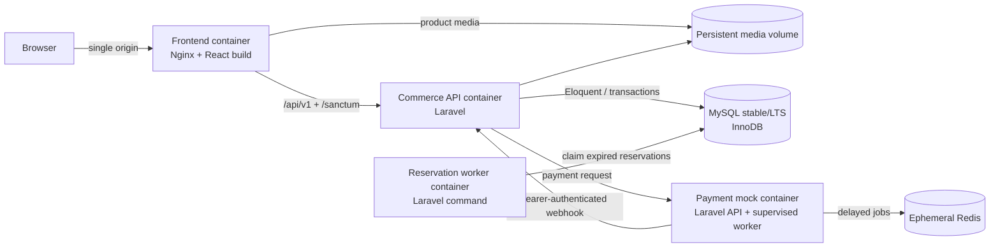
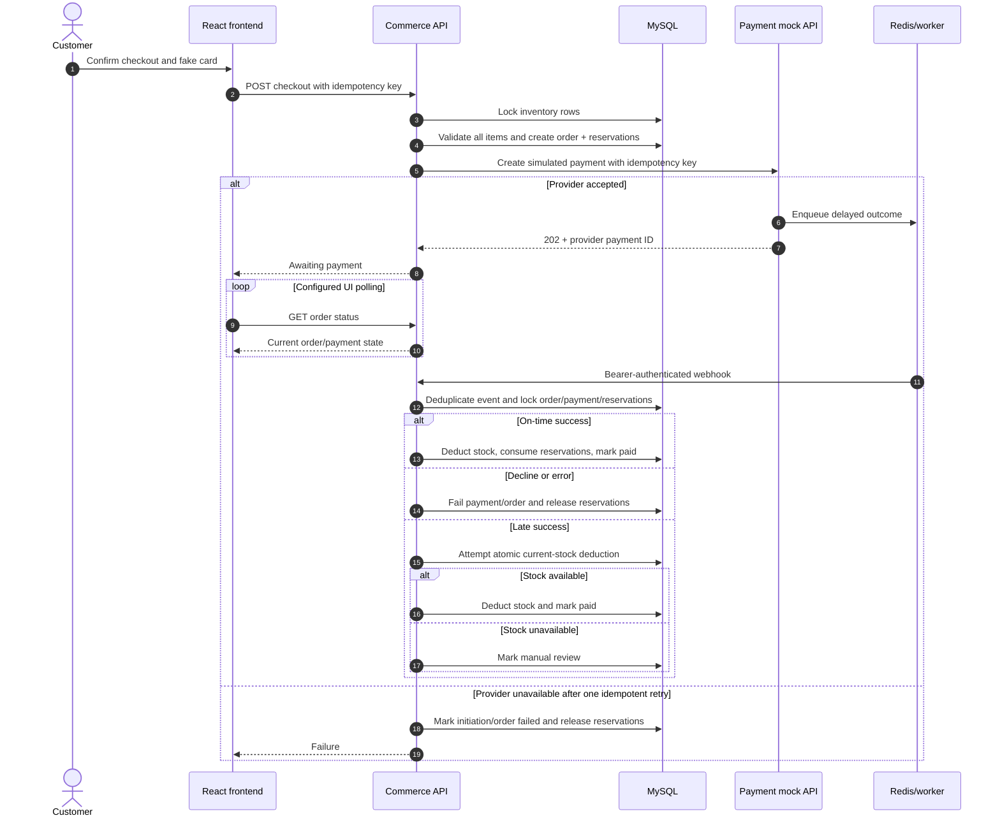
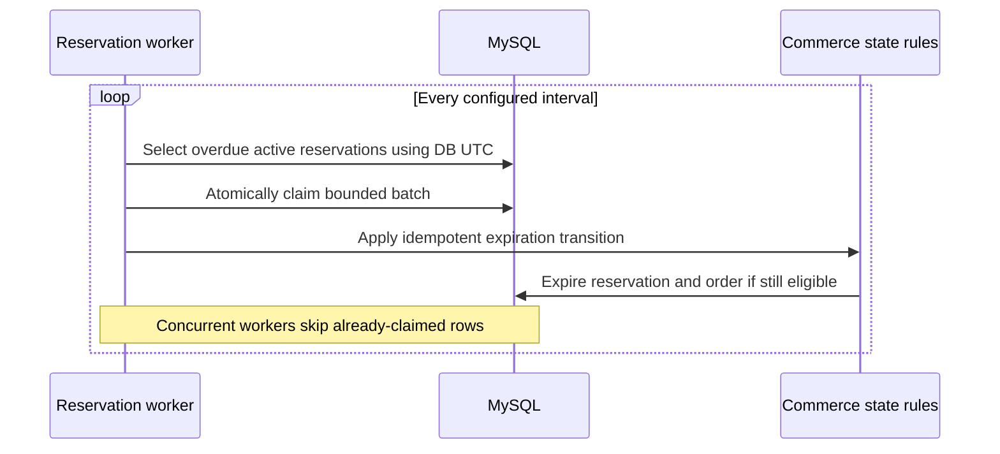

# Architecture

Operational startup details are in the [reviewer guide](reviewer-guide.md), and
implementation evidence is indexed in
[requirements-traceability.md](requirements-traceability.md#architecture).

## 1. Architectural intent

The implementation is a monorepo with independently containerized runtime responsibilities. The main commerce backend uses conventional Laravel layers and remains a single application rather than being split into business microservices. The mock payment provider is a separate service because the challenge specifically benefits from demonstrating an asynchronous external boundary.

The architecture favors correctness and reviewability over speculative scale. Production extensions are identified explicitly rather than partially implemented.

## 2. Monorepo target layout

```text
/
|-- apps/
|   |-- commerce-api/       Laravel commerce API and reservation command
|   |-- payments-api/       Laravel mock provider and queue worker
|   `-- web/                React/TypeScript/Vite application
|-- docs/
|   |-- decisions/          Focused architecture decision records
|   |-- examples/           Challenge-provided CSV sample
|   `-- ...                 Product, data, API, testing, and security specs
|-- openapi/
|   `-- commerce-api.yaml   Authoritative design-first REST contract
|-- docker/                 Container configuration and entrypoints
|-- compose.yaml
|-- package.json            npm workspace and repository scripts
`-- README.md
```

Each Laravel app owns its Composer manifest and lockfile. The root npm workspace owns repository-level tooling and the React application. Runtime code must not be shared by copying domain models between the commerce and payment services; their integration is the versioned HTTP contract.

## 3. Container topology



### 3.1 Frontend container

- Builds and serves the React SPA.
- Proxies `/api`, Sanctum, documentation, and media paths to the commerce backend as required.
- Provides one browser origin for cookie authentication and avoids unnecessary CORS complexity.
- Applies baseline security headers.

### 3.2 Commerce API container

- Owns durable business data and workflows.
- Exposes versioned REST endpoints and local interactive OpenAPI documentation.
- Performs authentication, authorization, validation, imports, cart/order operations, reservation creation, payment initiation, webhook handling, and admin operations.
- Stores uploaded product media on a persistent named volume.

### 3.3 Reservation worker container

- Uses the commerce API image and codebase but runs a dedicated Laravel command.
- Polls at a configurable interval, default five seconds.
- Claims overdue reservations atomically, uses database UTC time, and expires them idempotently.
- May have multiple replicas without processing one reservation twice.

### 3.4 Payment mock container

- Runs the Laravel API server and a queue worker as two supervised processes in one container.
- Accepts exact documented fake card numbers only.
- Enqueues a callback and immediately returns `202 Accepted`.
- Sends a delayed webhook and retries failed delivery three times with exponential backoff.
- This multi-process container is explicitly a mock-only simplification.

### 3.5 MySQL

- Uses InnoDB, foreign keys, unique constraints, decimal columns, transactions, and row-level locks.
- Contains logically separate databases/schemas where service data requires isolation. The payment mock does not persist payment data in MySQL.
- Uses a persistent named volume in the reviewer workflow.

### 3.6 Redis

- Holds only the payment mock's delayed jobs and ephemeral idempotency/outcome state.
- Persistence is disabled intentionally.
- Restarting Redis or the payment container can lose pending simulated payments; this is an accepted demo limitation.

## 4. Laravel internal layers

The commerce application uses conventional Laravel layers instead of repository abstractions or full DDD ceremony:

- **Routes and controllers**: HTTP mapping, status codes, and orchestration entrypoints only.
- **Form Requests**: input validation and request authorization.
- **Policies and middleware**: role, ownership, setup-state, rate-limit, and authentication controls.
- **Services**: imports, cart merge, checkout, reservations, payment coordination, webhook transitions, inventory adjustments, configuration, and audit behavior.
- **Eloquent models/query scopes**: persistence, relationships, scoped retrieval, and guarded state.
- **API Resources**: stable response serialization.
- **Commands**: reservation expiration and operational tasks.
- **Events/listeners/jobs**: only where asynchronous or decoupled behavior has a concrete benefit.

Services may use Eloquent directly. Transactions and locks are explicit at invariant boundaries. No repository interfaces are introduced without a real alternate persistence or testing need.

## 5. Major flow: checkout and asynchronous payment



### 5.1 Transaction boundaries

- Order creation and all cart reservations succeed together or roll back together.
- Inventory rows are locked in a stable order to reduce deadlock risk.
- Payment initiation is an external call and cannot share the database transaction. The durable state machine records the boundary and reconciles late outcomes.
- Webhook event deduplication and resulting state transition occur transactionally.
- Stock deduction and reservation consumption occur together.
- Admin inventory changes write the adjustment record in the same transaction.

## 6. Major flow: reservation expiration



The worker does not assume that a row returned by an earlier query is still eligible. Every transition rechecks state under lock.

## 7. Major flow: partial CSV import

1. Validate upload size, row limit, encoding, delimiter, and strict header allowlist.
2. Parse all SKUs first and mark every in-file duplicate occurrence invalid.
3. Create an import record capturing actor and chosen policies.
4. Process each non-duplicate row independently using the selected create/update/upsert and category policies.
5. Use a row-level transaction for product/category/inventory changes.
6. Record stock overrides as inventory adjustments.
7. Accumulate sanitized validation reasons without leaking exceptions.
8. Return counts and a downloadable rejected-row CSV.

Synchronous execution is bounded by environment-configurable limits. A production design should move steps 2-8 to durable background jobs.

## 8. Authentication and browser boundary

- Laravel Sanctum uses secure HTTP-only session cookies and CSRF protection.
- Frontend and commerce API appear under one origin through the frontend proxy.
- Admin and customer roles are mutually exclusive in demo behavior.
- Policies enforce permissions at the API even when the UI hides controls.
- Guest order links use random secrets; only token hashes are stored.

## 9. API and contract strategy

- REST/JSON under `/api/v1`.
- Design-first OpenAPI YAML is authoritative.
- A generated TypeScript client/types package is consumed by React.
- CI lints the contract, compares implementation coverage, validates responses, and detects stale generated client output.
- Errors use a consistent Problem Details representation.
- Checkout creation accepts an idempotency key.
- Admin edits use an integer version/optimistic concurrency check and return a conflict for stale writes.

## 10. Data and consistency choices

- ULIDs are primary identifiers everywhere.
- Orders additionally receive a concurrency-safe numeric sequence and configurable display prefix.
- UTC is stored and exchanged; browser display uses local time.
- Database UTC determines expirations.
- Monetary data uses fixed-precision decimals and explicit currencies.
- Submitted orders use immutable snapshots so later catalog/configuration edits cannot rewrite history.
- Soft-delete rules are entity-specific and documented in the product and data specifications.

## 11. Configuration

Configuration has two layers:

1. Environment values define deploy-time defaults and infrastructure settings.
2. An allowlisted typed settings table provides audited runtime overrides for approved keys.

The reservation timeout uses both layers: database override first, environment fallback second. Existing reservations keep their stored expiration time when settings change.

Expected documented environment settings include:

- MySQL and Redis connection settings
- Session/cookie and application secrets
- Webhook bearer token
- Default reservation timeout (120 seconds)
- Reservation polling interval (5 seconds)
- Guest-link lifetime (30 days)
- Normal mock delay range (2-8 seconds)
- Late-success mock delay (150 seconds)
- CSV byte and row limits
- Order-number prefix and initial numeric value
- API documentation enable/disable flag

## 12. Health and logs

- Each service exposes a minimal liveness/readiness endpoint suitable for Compose health checks.
- Services emit ordinary startup and error logs without secrets, tokens, card values, or unnecessary customer data.
- Structured cross-service observability, metrics, traces, dashboards, and alerting are out of scope and required for production planning.

## 13. Scalability and production evolution

No performance numbers are claimed. Before production, use forecasts plus load/stress tests to establish latency, throughput, concurrency, and capacity objectives.

Likely evolution paths include:

- Asynchronous imports with durable jobs
- Elasticsearch for catalog search
- Redis caching with designed invalidation
- Dedicated object storage and image processing
- Multiple warehouses and allocation logic
- Durable payment-provider integration and reconciliation
- Separate API/worker containers and independent scaling
- Push status updates through WebSockets or server-sent events
- Full monitoring, alerting, backup, recovery, and deployment automation

## 14. Deployment scope

Docker Compose is the local/reviewer deployment. Public cloud topology, TLS termination, secret management, autoscaling, managed data stores, backups, disaster recovery, and zero-downtime migrations are production infrastructure decisions and are not implied by the demo Compose file.
