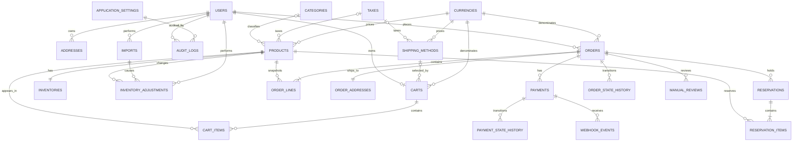
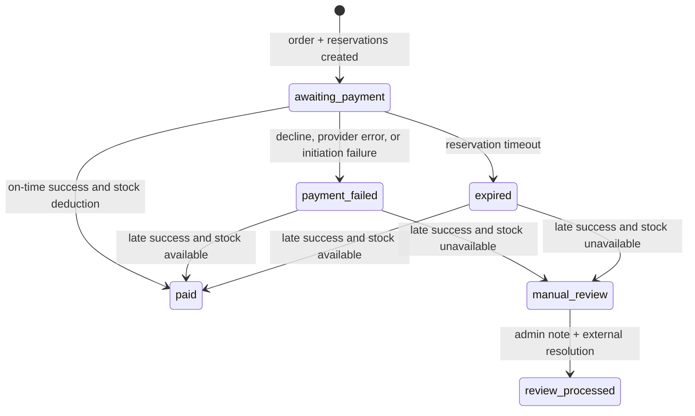
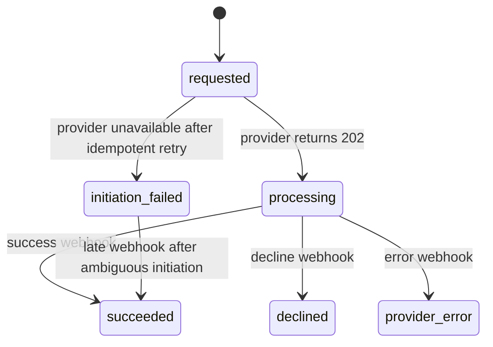

# Data Model

## 1. Modeling conventions

- Every primary key is a ULID.
- Foreign keys use matching ULID columns.
- Durable records include UTC `created_at` and `updated_at` timestamps where applicable.
- Soft-deletable records include `deleted_at`.
- Admin-editable records include an integer `version` for optimistic concurrency.
- Money uses `DECIMAL(19,4)` plus a currency reference; exchange rates use greater precision.
- Quantities are non-negative integers.
- Immutable histories and snapshots are append-only through application permissions.
- Exact column names may follow Laravel conventions, but the invariants in this document are authoritative.

## 2. Entity relationship overview

Some relations are snapshot/audit references rather than cascading lifecycle dependencies. Migration definitions must encode only the deletion behavior specified below.

## 3. Identity and addresses

### 3.1 `users`

Core fields:

- `id`
- `role`: `admin` or `customer`
- `name`
- `email` plus normalized comparison value/index
- `password_hash`
- `email_verified_at`, nullable and unused by the demo workflow
- timestamps

Invariants:

- Email is syntactically valid and case-insensitively unique.
- Exactly one admin may exist in the demo. A database-backed singleton/unique invariant plus transactional setup prevents races.
- Admin and customer capabilities are mutually exclusive.
- The sole admin cannot be deleted, deactivated, or demoted.

### 3.2 `addresses`

Core fields:

- `id`, `user_id`
- recipient name
- address lines 1 and 2
- city, state/region, postal code, ISO country code
- phone
- `is_default`
- timestamps

The schema supports multiple addresses, but demo application rules permit one address per customer and require it to be the default.

## 4. Catalog and configuration

### 4.1 `categories`

- `id`, `name`, normalized name, `version`, timestamps, `deleted_at`
- Unique normalized name among active rows.
- Soft deletion nulls category references on current products.

### 4.2 `taxes`

- `id`, `name`, normalized name, percentage `rate`, `version`, timestamps, `deleted_at`
- Rate constraint: 0 through 100 inclusive.
- Unique normalized name among active rows.
- Deletion is blocked while active products or shipping methods reference the row.

### 4.3 `currencies`

- `id`, `code`, `name`, `symbol`
- `rate_to_base`, `is_base`, `minor_units`, `rate_updated_at`
- timestamps, `deleted_at`

Constraints:

- ISO code is unique.
- Exactly one active base currency.
- USD is seeded with rate 1 and two minor units.
- No demo CRUD endpoint exists.

### 4.4 `shipping_methods`

- `id`, `name`, normalized name
- `amount`, `currency_id`, nullable `tax_id`
- `version`, timestamps, `deleted_at`

Constraints:

- Amount is non-negative.
- Name is unique among active rows.
- All demo methods reference USD.
- Soft deletion clears selection from active carts; order snapshots remain unchanged.

### 4.5 `products`

- `id`, `name`, normalized/per-search values as needed
- `sku`, normalized SKU with permanent unique constraint
- nullable `description`, `category_id`, and `tax_id`
- `price`, `currency_id`, `weight_kg`
- nullable image storage metadata/path
- `version`, timestamps, `deleted_at`

Constraints:

- Name/SKU nonblank; price and weight non-negative.
- SKU remains unique across active and soft-deleted products.
- Hard delete only when no order or reservation history exists.

## 5. Inventory

### 5.1 `inventories`

- `id`, unique `product_id`
- `stock_on_hand`
- `version`, timestamps

Available stock is derived from on-hand stock minus active reservation items; it is not a separately trusted mutable field.

### 5.2 `inventory_adjustments`

- `id`, `inventory_id`, `product_id`
- `previous_quantity`, `new_quantity`, signed `delta`
- reason code and nullable note
- `actor_user_id`
- nullable `import_id`
- timestamp

Records are immutable. Allowed reasons are `stock_received`, `correction`, `damaged_or_lost`, `customer_return`, `other`, and `csv_import`. `other` requires a note.

## 6. Cart

### 6.1 `carts`

- `id`, unique `user_id`
- `currency_id`
- nullable selected `shipping_method_id`
- timestamps, `version`

Only authenticated carts are durable. Guest carts live in browser local storage. Shipping-method deletion clears the nullable reference.

### 6.2 `cart_items`

- `id`, `cart_id`, `product_id`, `quantity`, timestamps
- Unique `(cart_id, product_id)`.
- Quantity must be positive.

Cart prices are not authoritative snapshots. The current catalog and configuration are re-read before checkout.

## 7. Order snapshots and state

### 7.1 `orders`

- `id`
- unique numeric `sequence_number`
- materialized/displayed `order_code`
- nullable `customer_user_id`
- guest/customer email snapshot
- `currency_id` and currency code snapshot
- `status`
- subtotal, product tax, shipping amount, shipping tax, grand total
- shipping method name snapshot
- guest token hash and guest-token expiration, nullable
- optimistic/state version and timestamps

The sequence begins from an environment-defined value only at initial setup. The display prefix is configurable. ULID remains the API identity.

### 7.2 `order_lines`

- `id`, `order_id`, nullable historical `product_id`
- product name and SKU snapshots
- quantity, weight snapshot
- unit price, line subtotal
- tax name/rate/amount snapshots
- line total and currency code/reference

Order-line values never change after submission.

### 7.3 `order_addresses`

- `id`, unique `order_id`
- complete recipient/contact/shipping snapshot

It is immutable and independent from a customer's saved address.

### 7.4 `order_state_history`

- `id`, `order_id`
- from/to state
- transition reason and metadata, redacted as needed
- nullable actor
- timestamp

### 7.5 Order state machine

There is no customer cancellation, retry-payment, fulfillment, refund, or return state in the demo. `review_processed` means only externally resolved.

## 8. Reservations

### 8.1 `reservations`

- `id`, `order_id`
- status: `active`, `consumed`, `released`, or `expired`
- `expires_at`, nullable claim/processing metadata
- timestamps

### 8.2 `reservation_items`

- `id`, `reservation_id`, `product_id`, `inventory_id`, quantity
- Unique product per reservation.

Invariants:

- All items for an order are reserved atomically.
- Active reservations reduce availability.
- A reservation transitions out of active at most once.
- Worker claims and transitions are concurrency-safe and idempotent.

## 9. Payments and webhook events

### 9.1 `payments`

- `id`, `order_id`
- unique commerce idempotency key
- nullable provider payment ID
- payment status
- amount, currency reference/code snapshot
- provider/error codes safe for display/logging
- timestamps

Exactly one payment attempt exists per demo order.

### 9.2 `payment_state_history`

- `id`, `payment_id`
- from/to state, reason/metadata, timestamp

### 9.3 Payment state machine

An order may expire while its payment remains `processing`. A later `succeeded` transition invokes the late-success order logic. Webhook delivery exhaustion exists only inside the ephemeral mock provider; commerce cannot learn that state if every callback attempt fails, so its payment remains `processing` while the order can expire.

### 9.4 `webhook_events`

- `id`
- unique provider event ID
- provider payment ID
- safe event type/status
- payload hash and redacted metadata
- received/processed timestamps and processing result

The unique provider event ID is the durable idempotency boundary. No card number is stored.

## 10. Manual review

### 10.1 `manual_reviews`

- `id`, unique `order_id`
- review reason, status
- nullable resolution note until processed
- resolved by admin and resolved timestamp
- created timestamp

Resolution note, actor, and time become mandatory on `review_processed`.

## 11. Imports

### 11.1 `imports`

- `id`, `actor_user_id`
- original filename
- import mode
- unknown-category policy
- stock-override flag and confirmation timestamp
- total/imported/warning/rejected counts
- timestamps

The downloadable rejection artifact may be generated for immediate response storage appropriate to the bounded synchronous workflow. It must contain only original row values plus sanitized reason text.

## 12. Settings and audit

### 12.1 `application_settings`

- `id`
- unique allowlisted key
- typed value representation and declared type
- description
- version and timestamps

Unknown keys cannot be created through the generic admin endpoint. The active reservation timeout checks the table first and environment fallback second.

### 12.2 `audit_logs`

- `id`, nullable actor user
- action code
- target type and target ULID
- redacted before/after data
- request context safe for retention
- timestamp

Audit rows are append-only and cannot be modified through the application.

## 13. Active-only uniqueness

Categories, taxes, and shipping methods require trimmed, case-insensitive uniqueness among active records while permitting name reuse after soft deletion. The implementation must use a MySQL-compatible enforcement strategy, backed by tests, rather than relying only on application prechecks.

SKU differs: its normalized value remains globally unique even after product soft deletion.

## 14. Deletion summary

| Entity | Behavior |
| --- | --- |
| Product | Hard delete if never in order/reservation history; otherwise soft delete; SKU always reserved |
| Category | Soft delete and null current product category references |
| Tax | Soft delete only after active product/shipping references are cleared |
| Shipping method | Soft delete and clear active cart selections |
| Currency | No demo CRUD; USD cannot be removed through the app |
| User/account | Deletion/anonymization out of scope pending policy |
| Order/payment/reservation/history/audit | Never user-deleted through the demo |

## 15. Indexing intent

At minimum, migrations should support:

- Normalized unique emails, SKUs, and active-only names
- Product search/filter/sort fields
- Order code/sequence, customer, email, state, and date filters
- Payment provider ID/idempotency key
- Active reservation expiration scans and product availability checks
- Webhook event idempotency
- Audit actor/action/target/date search

Exact indexes must be verified with representative data and query plans; no performance claim is made without testing.
